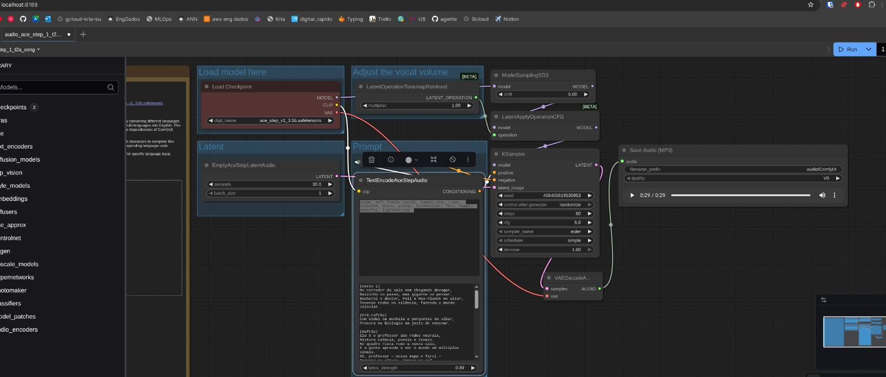

# Texto para Áudio

Esta implementação utilizando o **ComfyUI** foi voltada para a transformação de um *prompt* em texto em áudio/música. Essa técnica faz parte da classe de modelos conhecidos como **Text-to-Audio Diffusion Models**, que utilizam redes neurais para gerar áudio original a partir de descrições textuais. Nesta seção, será explicado o **workflow estruturado** para essa etapa e o papel de cada elemento do pipeline. A figura a seguir mostra o fluxo completo dentro do ComfyUI, em que cada caixa representa um componente específico do processo.

/// caption
Workflow completo de texto para áudio.

Produção autoral
///

O pipeline se inicia com o nó **Load Checkpoint**, responsável por carregar o modelo principal de difusão — no caso, o modelo **ace_step_v1_3.5b.safetensors**. Esse é o modelo **AceStep**, uma adaptação do AudioCraft para o ComfyUI, especializado em gerar música e voz a partir de texto. O *checkpoint* contém os pesos aprendidos da rede neural, que são o resultado de um treinamento prévio em milhões de pares de áudio e descrições textuais. Assim, é nele que estão armazenados o conhecimento sonoro e a capacidade de associação entre palavras e elementos musicais do modelo. O nó fornece duas saídas principais:

* **MODEL**, que contém a rede de difusão propriamente dita (usada pelo KSampler);
* **CLIP**, que é o módulo de processamento textual.

A seguir, entra em cena o nó **TextEncodeAceStepAudio**. Similar ao CLIP usado em modelos de imagem, este componente transforma o texto fornecido em uma representação numérica chamada **vetor de embeddings**, que descreve semanticamente o conteúdo do texto. No pipeline de áudio, o prompt pode conter:

1. Descrições do estilo musical desejado (por exemplo: "funk, pop, guitar, happy, lighthearted");
2. Letras completas da música a ser gerada.

Esse vetor de condicionamento é enviado ao próximo nó, que é o **KSampler**.

Antes do KSampler, há também o nó **EmptyAceStepLatentAudio**. Ele é responsável por criar um "áudio inicial" no **espaço latente**, um espaço matemático de menor dimensionalidade onde o modelo trabalha durante a difusão. Em vez de gerar o áudio diretamente em forma de onda, o modelo opera nesse espaço comprimido, o que reduz o custo computacional e permite maior estabilidade. Nesse nó, define-se:

* **seconds**: a duração do áudio a ser gerado (por exemplo, 30.0 segundos);
* **batch_size**: o número de faixas que serão geradas simultaneamente.

Como o nome indica, esse áudio latente é inicialmente "vazio", preenchido com ruído aleatório.

Entre o espaço latente e o KSampler, há o nó **LatentOperationTonemapReinhard**, que ajusta o volume ou intensidade do som dentro do espaço latente. O parâmetro **multiplier** controla o ganho, permitindo aumentar ou diminuir o volume global da saída vocal antes mesmo da decodificação final.

O **KSampler** é o núcleo do processo de geração. Ele é o componente responsável por *"guiar"* o ruído inicial para uma forma coerente, de acordo com o conteúdo textual definido pelo *prompt*. Esse processo é conhecido como **difusão reversa**, onde o modelo aprende a transformar gradualmente o ruído em áudio, passo a passo.

Dentro desse nó, cada parâmetro controla um aspecto essencial do comportamento do modelo:

* **model**: conecta o modelo principal carregado no *checkpoint*.
* **positive**: é o condicionamento de texto, oriundo do TextEncodeAceStepAudio.
* **latent_image**: é a entrada de ruído gerada pelo EmptyAceStepLatentAudio.
* **seed**: define a aleatoriedade da geração; mudar o seed altera os detalhes sonoros, mesmo com o mesmo prompt.
* **steps**: número de etapas de amostragem. Quanto mais etapas, mais o áudio será detalhado, porém será mais lento para gerar.
* **cfg (Classifier-Free Guidance)**: controla o quanto o modelo deve "seguir" o texto — valores altos aumentam a fidelidade ao prompt, mas podem introduzir artefatos.
* **sampler_name**: define o algoritmo usado para a difusão, cada um com seu estilo de convergência (por exemplo, euler).
* **scheduler**: regula a progressão da remoção de ruído ao longo dos passos, influenciando suavidade e coerência.
* **denoise**: define a intensidade da difusão — valores menores permitem refinar ou preservar partes do áudio, úteis para edições.

O resultado final desse nó é um **áudio latente** já estruturado, mas ainda não em formato de onda sonora compreensível.

Por fim, esse áudio latente é enviado ao **VAEDecodeAudio**, cuja função é **decodificar** o espaço latente em um áudio real, em forma de onda (*waveform*). Similar ao VAE usado em modelos de imagem, este componente é responsável por converter o espaço latente em um sinal de áudio que pode ser reproduzido. A qualidade e fidelidade da reconstrução dependem do decodificador utilizado.

O resultado do VAE é, então, enviado ao nó **Save Audio (MP3)**, que exporta o áudio final para um arquivo MP3 e permite a pré-visualização do resultado. Nesse ponto, a conversão de texto em áudio está completa: a descrição textual fornecida foi traduzida, pelo processo de difusão e decodificação, em uma faixa de áudio coerente.

Em resumo, o workflow segue a seguinte lógica conceitual:

1. **Carregar o modelo base (Load Checkpoint)**
2. **Codificar o texto (TextEncodeAceStepAudio)**
3. **Gerar um áudio latente inicial (EmptyAceStepLatentAudio)**
4. **Ajustar o volume no espaço latente (LatentOperationTonemapReinhard)**
5. **Aplicar a difusão guiada pelo prompt (KSampler)**
6. **Decodificar o espaço latente em forma de onda (VAEDecodeAudio)**
7. **Salvar e visualizar o resultado (Save Audio)**

Esse pipeline ilustra o funcionamento fundamental dos modelos generativos de áudio: transformar linguagem natural em representações sonoras por meio de redes neurais que compreendem tanto o texto quanto a estrutura musical e vocal. O processo como um todo é baseado na difusão do áudio, seguindo princípios similares aos modelos de imagem.

A **difusão** no contexto de áudio funciona de maneira análoga à difusão de imagens: começamos de "ruído puro" (ruído gaussiano no espaço latente) e, passo a passo, vamos **removendo** o ruído certo até que reste um áudio coerente. Durante o treinamento, o modelo aprende duas operações complementares:

1. a **difusão direta** (*forward diffusion*), que pega um áudio real e adiciona ruído gradualmente até ficar irreconhecível;
2. a **difusão reversa** (*reverse diffusion*), que aprende a **prever o ruído** presente num estado intermediário e, ao removê-lo, aproximar esse estado de um áudio plausível.

Na geração, só usamos a parte reversa, partindo do ruído e repetindo o processo de "prever ruído → remover ruído" por um certo número de **steps** até chegar a um latente limpo. No workflow em questão, quem executa essas iterações é o **KSampler**. A cada passo, o modelo recebe: o latente ruidoso, o **timestep** (que diz "quanto ruído ainda deve existir") e o **condicionamento de texto** (os vetores produzidos pelo TextEncodeAceStepAudio). Ele devolve a **previsão de ruído**, que o sampler usa para atualizar o latente. O **scheduler** controla o "ritmo" dessa limpeza (a curva de ruído ao longo do tempo), enquanto o **sampler** define o método numérico de integração. Mais *steps* tendem a refinar mais, porém com retornos decrescentes e maior custo.

O condicionamento textual atua via **Classifier-Free Guidance (CFG)**. Em termos simples, o modelo faz duas previsões de ruído: uma **sem** texto (previsão *unconditional*) e outra **com** texto (previsão *conditional*). Elas são combinadas por um fator de guia (o parâmetro **cfg**):

$$
\hat{\epsilon} = \hat{\epsilon}_{\text{uncond}} + s \cdot (\hat{\epsilon}_{\text{cond}} - \hat{\epsilon}_{\text{uncond}})
$$

Quando o valor de CFG é baixo, o áudio pode ficar natural, porém pouco fiel ao prompt. Quando é alto, segue fielmente o texto, mas pode introduzir artefatos sonoros ou distorções.

Por fim, o parâmetro **denoise** define quanto desse processo de limpeza será aplicado. Com *denoise = 1.0*, você realiza a cadeia completa (útil para *text-to-audio* puro). Com valores menores, preserva-se parte da estrutura do latente de entrada — isso é a base de refinamentos e edições de áudio.

Em suma, o modelo começa no **ruído** (EmptyAceStepLatentAudio), o **KSampler** executa múltiplos passos de remoção de ruído guiada pelo texto (via TextEncodeAceStepAudio e CFG), o **scheduler/sampler** dita o caminho numérico dessa caminhada, e o **VAEDecodeAudio** decodifica o latente final para forma de onda que você pode ouvir. Essa dança entre ruído, guia textual e integração numérica é o que transforma um prompt em uma faixa de áudio consistente.
