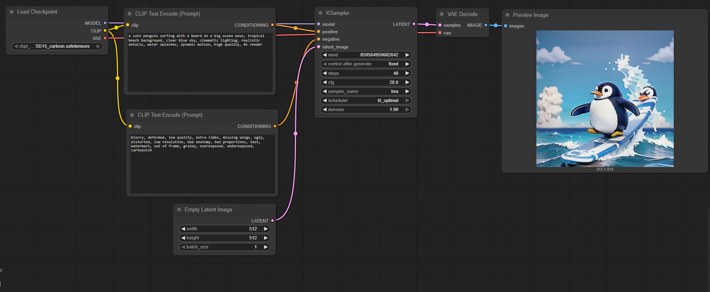

# Texto para Imagem

Como dito anteriormente, essa primeira implementação utilizando o **ComfyUI** foi voltada para a transformação de um *prompt* em texto em uma imagem. Essa técnica faz parte da classe de modelos conhecidos como **Text-to-Image Diffusion Models**, que utilizam redes neurais para gerar imagens originais a partir de descrições textuais. Nesta seção, será explicado o **workflow estruturado** para essa etapa e o papel de cada elemento do pipeline. A figura a seguir mostra o fluxo completo dentro do ComfyUI, em que cada caixa representa um componente específico do processo.

/// caption
Workflow completo de texto para imagem.

Produção autoral
///

O pipeline se inicia com o nó **Load Checkpoint**, responsável por carregar o modelo principal de difusão — no caso, o modelo **SD15_cartoon.safetensors**. Esse nome indica uma variação do *Stable Diffusion 1.5*, mas treinada para gerar imagens em um estilo **cartoon**. O *checkpoint* contém os pesos aprendidos da rede neural, que são o resultado de um treinamento prévio em milhões de pares de imagens e descrições textuais. Assim, é nele que estão armazenados o conhecimento visual e a capacidade de associação entre palavras e elementos visuais do modelo. Esse modelo já treinado foi baixado do site [CIVITAI](https://civitai.com/), sendo necessário apenas a instalação e aplicação no projeto. Importante citar aqui que esse modelo baixado tem o estilo de cartoon, porém na fonte utilizada, é possível encontrar diversos outros modelos do mesmo tipo (*Stable Diffusion 1.5*) mas com outro foco de treinamento que vai entregar outros valores para os parâmetros, e portanto, outro estilo para a imagem. O nó também fornece as três saídas principais do modelo:

* **MODEL**, que contém a rede de difusão propriamente dita (usada pelo KSampler);
* **CLIP**, que é o módulo de processamento textual;
* **VAE**, que é o módulo de codificação e decodificação das imagens em um espaço latente comprimido.

A seguir, entram em cena dois nós chamados **CLIP Text Encode (Prompt)**. O CLIP — *Contrastive Language–Image Pre-training* — é uma rede neural desenvolvida para compreender a relação entre texto e imagem. Ele transforma o texto fornecido em uma representação numérica chamada **vetor de embeddings**, que descreve semanticamente o conteúdo do texto. No pipeline, há dois CLIPs:

1. O primeiro é o *prompt positivo*, que contém a descrição desejada da imagem:
2. O segundo é o *prompt negativo*, que especifica o que **não** deve aparecer na imagem. Essa etapa é essencial para orientar o modelo a evitar erros comuns e melhorar a qualidade final da saída.

Esses dois vetores de condicionamento são enviados ao próximo nó, que é o **KSampler**.

Antes do KSampler, há também o nó **Empty Latent Image**. Ele é responsável por criar uma “imagem inicial” no **espaço latente**, um espaço matemático de menor dimensionalidade onde o modelo trabalha durante a difusão. Em vez de gerar a imagem diretamente em pixels, o Stable Diffusion opera nesse espaço comprimido, o que reduz o custo computacional e permite maior estabilidade. Nesse nó, define-se o tamanho da imagem e o número de imagens que serão geradas (*batch size*). Como o nome indica, essa imagem é inicialmente “vazia”, preenchida com ruído aleatório.

O **KSampler** é o núcleo do processo de geração. Ele é o componente responsável por *“guiar”* o ruído inicial para uma forma coerente, de acordo com o conteúdo textual definido pelos *prompts*. Esse processo é conhecido como **difusão reversa**, onde o modelo aprende a transformar gradualmente o ruído em imagem, passo a passo.
Dentro desse nó, cada parâmetro controla um aspecto essencial do comportamento do modelo:

* **model**: conecta o modelo principal carregado no *checkpoint*.
* **positive** e **negative**: são os condicionamentos de texto, oriundos dos CLIP encoders.
* **latent_image**: é a entrada de ruído gerada pelo Empty Latent Image.
* **seed**: define a aleatoriedade da geração; mudar o seed altera os detalhes visuais, mesmo com o mesmo prompt.
* **steps**: número de etapas de amostragem. Quanto mais etapas, mais a imagem vai ser detalhada, porém será mais lenta para gerar.
* **cfg (Classifier-Free Guidance)**: controla o quanto o modelo deve “seguir” o texto — valores altos aumentam a fidelidade ao prompt, mas podem reduzir a naturalidade da imagem.
* **sampler_name**: define o algoritmo usado para a difusão, cada um com seu estilo de convergência.
* **scheduler**: regula a progressão da remoção de ruído ao longo dos passos, influenciando suavidade e coerência.
* **denoise**: define a intensidade da difusão — valores menores permitem refinar ou preservar partes da imagem, úteis para edições.

O resultado final desse nó é uma **imagem latente** já estruturada, mas ainda não em formato visual compreensível.

Por fim, essa imagem latente é enviada ao **VAE Decode**, cuja função é **decodificar** o espaço latente em uma imagem real, em pixels. O termo VAE vem de *Variational Autoencoder*, um tipo de rede neural usada para compressão e reconstrução de dados. No contexto do Stable Diffusion, o VAE é responsável por converter o espaço latente em uma imagem RGB que pode ser visualizada. A qualidade e fidelidade da reconstrução dependem muito do VAE utilizado, e por isso é comum usar VAEs específicos — no caso representado o VAE utilizado foi o carregado junto ao SD15_cartoon.

O resultado do VAE é, então, enviado ao nó **Preview Image**, que exibe a imagem final na interface do ComfyUI. Nesse ponto, a conversão de texto em imagem está completa: a descrição textual fornecida ao CLIP foi traduzida, pelo processo de difusão e decodificação, em uma imagem visual coerente, gerando o *pinguim surfando em um estilo cartoon* mostrado na pré-visualização.

Em resumo, o workflow segue a seguinte lógica conceitual:

1. **Carregar o modelo base (Load Checkpoint)**
2. **Codificar os textos positivos e negativos (CLIP Text Encode)**
3. **Gerar uma imagem latente inicial (Empty Latent Image)**
4. **Aplicar a difusão guiada pelos prompts (KSampler)**
5. **Decodificar o espaço latente em pixels (VAE Decode)**
6. **Visualizar o resultado (Preview Image)**

Esse pipeline ilustra o funcionamento fundamental dos modelos generativos modernos: transformar linguagem natural em representações visuais por meio de redes neurais que compreendem tanto o texto quanto a estrutura visual do mundo. O processo como um todo é baseado na difusão da imagem. Uma boa maneira de imaginar a **difusão** é pensar numa foto coberta de poeira: a imagem existe, mas está escondida sob camadas de ruído. O modelo aprende a **tirar a poeira, aos poucos**, até revelar um conteúdo coerente. Nos modelos modernos, fazemos o inverso de como foram treinados: começamos de “poeira pura” (ruído gaussiano no espaço latente) e, passo a passo, vamos **removendo** o ruído certo até que reste uma imagem.

Durante o treinamento, o modelo aprende duas operações complementares:

1. a **difusão direta** (*forward diffusion*), que pega uma imagem real e adiciona ruído gradualmente até ficar irreconhecível;
2. a **difusão reversa** (*reverse diffusion*), que aprende a **prever o ruído** presente num estado intermediário e, ao removê-lo, aproximar esse estado de uma imagem plausível.

Na geração, só usamos a parte reversa, partindo do ruído e repetindo o processo de “prever ruído → remover ruído” por um certo número de **steps** até chegar a um latente limpo. No workflow em questão, quem executa essas iterações é o **KSampler**. A cada passo (t), o modelo (um U-Net dentro do Stable Diffusion) recebe: o latente ruidoso, o **timestep** (que diz “quanto ruído ainda deve existir”) e o **condicionamento de texto** (os vetores produzidos pelos dois CLIPs). Ele devolve a **previsão de ruído** (\hat{\epsilon}), que o sampler usa para atualizar o latente. O **scheduler** controla o “ritmo” dessa limpeza (a curva de ruído ao longo do tempo), enquanto o **sampler** define o método numérico de integração (LMS, Euler, DPM++ etc.). Mais *steps* tendem a refinar mais, porém com retornos decrescentes e maior custo.

O condicionamento textual atua via **Classifier-Free Guidance (CFG)**. Em termos simples, o modelo faz duas previsões de ruído: uma **sem** texto (previsão *unconditional*) e outra **com** texto (previsão *conditional*). Elas são combinadas por um fator de guia (s) (o seu **cfg**):

$$
[
\hat{\epsilon} ;=; \hat{\epsilon}*{\text{uncond}} ;+; s,\big(\hat{\epsilon}*{\text{cond}} - \hat{\epsilon}_{\text{uncond}}\big).
]
$$

Quando (s) é baixo, a imagem pode ficar bonita, porém pouco fiel ao prompt. Quando é alto, segue fielmente o texto, mas pode introduzir saturação, artificiais ou *banding*. Os **prompts negativo e positivo** entram exatamente aqui, puxando a previsão condicional para aproximar o que você descreveu e “afastar” o que você rejeitou.

Por fim, o parâmetro **denoise** define quanto desse processo de limpeza será aplicado. Com *denoise = 1.0*, você realiza a cadeia completa (útil para *text-to-image* puro). Com valores menores, preserva-se parte da estrutura do latente de entrada — isso é a base do *image-to-image* e de refinamentos: o sampler aplica apenas um “trecho” da caminhada de ruído → imagem, mantendo composição ou cores originais.

Em suma, o modelo começa no **ruído** (Empty Latent Image), o **KSampler** executa múltiplos passos de remoção de ruído guiada pelo texto (via CLIP e CFG), o **scheduler/sampler** dita o caminho numérico dessa caminhada, e o **VAE** decodifica o latente final para pixels que você vê no Preview. Essa dança entre ruído, guia textual e integração numérica é o que transforma um prompt em uma imagem consistente.
