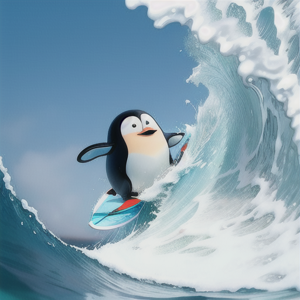
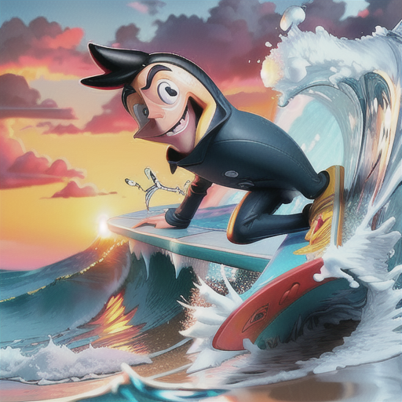

# Resultados - Texto para Imagem

Nessa secção serão apresentadas as imagens geradas com o worflow apresentado anteiormente ([Implementação](https://luccagkao.github.io/comfyui-experiment/implementacao/text2image/)). Além da apresentação dos resultados encontrados, serão discutidos os parâmetros utilizados em cada uma das gerações, bem como, o que era esperado de impacto com a mudança de cada um deles, e também, o que foi encontrado de fato ao mud=a-los. O objetivo principal, e utilizado como parâmetro para análise das imagens geradas, era de criar uma imagem de um penguin surfando uma onda, tudo isso com um estilo de cartoon/animação.

## 1º OUTPUT — (baseline do workflow)

### Parâmetros utilizados

* **Checkpoint**: `SD15_cartoon.safetensors` (CLIP + MODEL + VAE do checkpoint)
* **Prompt positivo (CLIP)**: “a cute penguin surfing with a board on a big ocean wave, tropical beach background, clear blue sky, cinematic lighting, high quality, 4k render, dynamic motion, water splashes”
* **Prompt negativo (CLIP)**: “blurry, deformed, low quality, missing wings, extra limbs, ugly, distorted, low resolution, bad anatomy, bad proportions, text, watermark, out of frame, grainy, over/underexposed, cartoonish”
* **Empty Latent Image**: 512×512, batch_size 1
* **KSampler**:

  * seed: **859584950682642** (fixo na execução)
  * steps: **40**
  * cfg: **20.0**
  * sampler: **LMS**
  * scheduler: **kl_optimal**
  * denoise: **1.00**
* **VAE Decode**: VAE do próprio checkpoint

### Imagem gerada

*Figura — baseline (meio do dia, 2 pinguins no longboard).*

### Comparação Output x Objetivo principal

A imagem correspondeu bem ao objetivo de ter um pinguim (na prática, dois) surfando em água azul com céu limpo, reforçando o efeito de um CFG muito alto e steps suficientes para estabilizar contornos e texturas. A espuma e as bordas do longboard saíram nítidas, com brilho “plastificado” típico do checkpoint cartoon. Não há artefatos relevantes nem “banding” no céu, o que indica que o scheduler escolhido ajudou a suavizar gradientes. Um detalhe interessante é que, mesmo com “cartoonish” no prompt negativo, o estilo permaneceu cartoon — isso evidencia que o viés do checkpoint predominou sobre a tentativa de “descartoonizar” via negativo. Em resumo: alta fidelidade ao prompt, estética limpa e previsível, com baixa variabilidade criativa.

## 2º OUTPUT — (steps baixos + cfg baixo; enfoque em naturalidade)

### Parâmetros utilizados

* **Prompt positivo (CLIP)**: “a cute cartoon penguin surfing a breaking wave, medium shot, tropical beach in background, clear blue sky, gentle cinematic lighting, soft colors, simple composition, 4k, clean outlines, smooth shading”
* **Prompt negativo (CLIP)**: “blurry, noisy, low quality, low resolution, bad anatomy, extra limbs, extra beak, text, watermark, logo, out of frame, over/underexposed, jpeg artifacts”
* **KSampler**:

  * seed: **1337**
  * steps: **15**
  * cfg: **6.5**
  * sampler: **euler_a**
  * scheduler: **karras**
  * denoise: **1.00**

### Imagem gerada

*Figura — composição simples, **espuma suave**, menos detalhe fino.*

### Comparação Output x Objetivo principal

Aqui, a redução dos steps e o CFG mais baixo produziram exatamente o comportamento esperado: a cena ficou mais “pintada”, com gradientes suaves e menos microdetalhe na espuma e no contorno do sujeito. O sampler ancestral favoreceu um traço mais solto e uma leve sensação de movimento, ao custo de bordas menos rígidas. A composição ficou simples e legível, com o pinguim destacado sobre a onda sem poluição visual. Pequenas variações de modelagem do personagem (formato do bico, proporções do corpo) são coerentes com o aumento de liberdade criativa dado pelo CFG mais baixo. É um bom exemplo de como “abrir a mão” do guia torna o estilo mais orgânico e menos literal.

## 3º OUTPUT — (detalhe alto; foco em nitidez e consistência)

### Parâmetros utilizados

* **Prompt positivo (CLIP)**: “two cute cartoon penguins surfing the same longboard, dynamic splash, close-up and sharp details, tropical waters, bright sunlight, crisp specular highlights, high detail, studio-quality render, 4k”
* **Prompt negativo (CLIP)**: “blurry, low quality, low resolution, bad anatomy, extra fingers, extra wings, deformed beak, text, watermark, signature, out of frame, grainy, banding”
* **KSampler**:

  * seed: **20251110**
  * steps: **50**
  * cfg: **9.0**
  * sampler: **dpmpp_2m**
  * scheduler: **karras**
  * denoise: **1.00**

### Imagem gerada

*Figura — dois personagens lado a lado (pinguim + humanoide), look “toy”.*

### Comparação Output x Objetivo principal

A proposta era obter dois pinguins em plano mais fechado, com alta nitidez. De fato, o aumento de steps e o uso de um sampler voltado a contornos limpos elevaram o nível de detalhe em água, spray e materiais; porém, o conteúdo derivou para um humanoide ao lado do pinguim. Essa deriva é um sintoma clássico de viés do dataset somado a um negativo pouco específico: sem proibições explícitas a “human/person/humanoid”, o modelo “preenche” a cena com o tipo de personagem que conhece bem para o estilo. Em termos qualitativos, o resultado é tecnicamente bom (texturas e bordas estão superiores aos cenários de menos steps), mas semanticamente abaixo do esperado. Como correção, seria recomendável reforçar o sujeito logo no início do prompt (“two penguins…”) e colocar bloqueios negativos de humanos.

## 4º OUTPUT — (direção estilística: cel-shading/HQ)

### Parâmetros utilizados

* **Prompt positivo (CLIP)**: “cartoon penguin surfing a huge ocean wave, **cel-shading**, thick ink outlines, comic book halftone texture, vibrant flat colors, exaggerated motion lines, dynamic angle, 4k, stylized illustration”
* **Prompt negativo (CLIP)**: “photorealistic, realistic skin, fine pores, photographic bokeh, text, watermark, logo, noisy, low quality, out of frame, deformed anatomy”
* **KSampler**:

  * seed: **8675309**
  * steps: **30**
  * cfg: **7.0**
  * sampler: **euler**
  * scheduler: **normal**
  * denoise: **1.00**

### Imagem gerada

*Figura — estilo **cel-shading** forte, contornos espessos; sujeito humanoide na crista da onda.*

### Comparação Output x Objetivo principal

A direção de estilo para cel-shading foi atingida com clareza: cores chapadas, contornos grossos e sensação de ilustração de HQ. Entretanto, o conteúdo novamente cedeu para um surfista humano em vez do pinguim. O conjunto CFG moderado + scheduler normal favoreceu a dominância do estilo sobre o tema, e, sem negativas explícitas a humanos, o checkpoint cartoon “puxou” para sua zona de conforto (personagem humano estilizado). O resultado é ótimo para demonstrar como termos de estilo fortes podem “abafar” o sujeito se o guia não for suficientemente enfático. Se o objetivo fosse manter o pinguim, bastaria subir levemente o CFG, mover os tokens de estilo para o final do prompt e incluir negativas de humano.

## 5º OUTPUT — (composição ampla, pôr do sol; guia forte + denoise parcial)

### Parâmetros utilizados

* **Prompt positivo (CLIP)**: “cartoon penguin surfing at **sunset**, wide shot, golden hour lighting, dramatic sky with warm clouds, long lens compression, reflective water, motion blur on spray, cinematic composition, 4k”
* **Prompt negativo (CLIP)**: “blurry subject, low quality, low resolution, bad anatomy, extra limbs, multiple heads, text, watermark, logo, out of frame, over/underexposed, color banding”
* **KSampler**:

  * seed: **314159265**
  * steps: **45**
  * cfg: **12.0**
  * sampler: **dpmpp_sde**
  * scheduler: **karras**
  * denoise: **0.85**

### Imagem gerada

*Figura — pôr do sol, paleta quente, pinguim de roupa de neoprene; gradientes suaves.*

### Comparação Output x Objetivo principal

Com pôr do sol, CFG alto, sampler SDE e denoise < 1, o comportamento foi exemplar: paleta quente coesa, gradientes suaves no céu e na água e um look mais “soft” que combina com a golden hour. A roupa de neoprene e o desenho mais “cinematográfico” do personagem mostram como o modelo respondeu ao pedido de composição ampla e dramática, priorizando leitura e iluminação. Perde-se um pouco de microcontraste em relação ao baseline — efeito natural do denoise 0.85 —, mas ganha-se coesão de luz e atmosfera. É o caso que melhor ilustra o alinhamento entre intenção de cena, parâmetros e resultado visual.

## Comparação imagens

| Output       | Prompt (resumo)                    |  Steps |      CFG | Sampler   | Scheduler  |  Denoise | Observação central                            |
| ------------ | ---------------------------------- | -----: | -------: | --------- | ---------- | -------: | --------------------------------------------- |
| 1 (baseline) | Pinguim(s) surfando, céu azul      |     40 | **20.0** | LMS       | kl_optimal |     1.00 | Fidelidade alta, look limpo/cartoon           |
| 2            | Pinguim, composição simples/soft   | **15** |  **6.5** | euler_a   | karras     |     1.00 | Menos detalhe, traço solto, suavidade         |
| 3            | Dois pinguins, close, alto detalhe | **50** |      9.0 | dpmpp_2m  | karras     |     1.00 | Nitidez alta; porém derivou p/ humanoide      |
| 4            | Cel-shading/HQ, linhas grossas     |     30 |      7.0 | euler     | **normal** |     1.00 | Estilo forte; conteúdo derivou p/ humanoide   |
| 5            | Pôr do sol, wide, cinemático       |     45 |     12.0 | dpmpp_sde | karras     | **0.85** | Gradientes suaves, look “soft” e fiel ao tema |

### O que era esperado com as mudanças dos parâmetros?

* **Steps**: mais passos ⇒ mais oportunidade de **refino fino** (bordas/espuma/mini-texturas). Menos passos ⇒ aspecto **pintado/sintético**, maior variabilidade entre seeds.
* **CFG**: baixo ⇒ **naturalidade** e liberdade estilística (risco de se afastar do texto); alto ⇒ **fidelidade ao prompt** (risco de saturação/artefatos ou “engessamento”).
* **Sampler**:

  * *euler_a* (ancestral): traço **mais solto/variável**;
  * *euler*: traço **firme**, menos “ruído criativo”;
  * *dpmpp_2m*: **limpeza/nitidez** de contornos;
  * *dpmpp_sde*: **gradientes** e transições suaves, bom para cenas com céu/água.
* **Scheduler**: *karras* suaviza a progressão do ruído (menos “quebra” de tons); *normal* tende a resultados mais “crus/contrastados”, o que em conjunto com CFG médio pode favorecer o **estilo** sobre o **conteúdo**.
* **Denoise**: 1.0 executa a cadeia completa (T2I puro); <1.0 **amortece** o processo (útil para looks mais suaves ou para preservar estrutura em i2i).

### O que foi observado com as mudanças?

* **Output 1** confirmou que **CFG muito alto (20)** trava o conteúdo no prompt, com estética cartoon limpa.
* **Output 2** mostrou o efeito combinado de **steps baixos + euler_a + CFG baixo**: **suavidade**, menos microdetalhe e mais “pincelada”.
* **Output 3** confirmou a **nitidez** de *dpmpp_2m* com steps altos, mas revelou **viés de dataset**: sem negativo explícito de “human”, o modelo **derivou** para humanoide.
* **Output 4** evidenciou que **termos de estilo** (cel-shading, comic) com **CFG médio** e **scheduler normal** podem **sobrepor o conteúdo** (humano em vez de pinguim).
* **Output 5** entregou exatamente o esperado para **pôr do sol**: **paleta quente**, **gradientes suaves** e leve **softness** por conta do **denoise 0.85**, mantendo boa fidelidade (CFG 12).